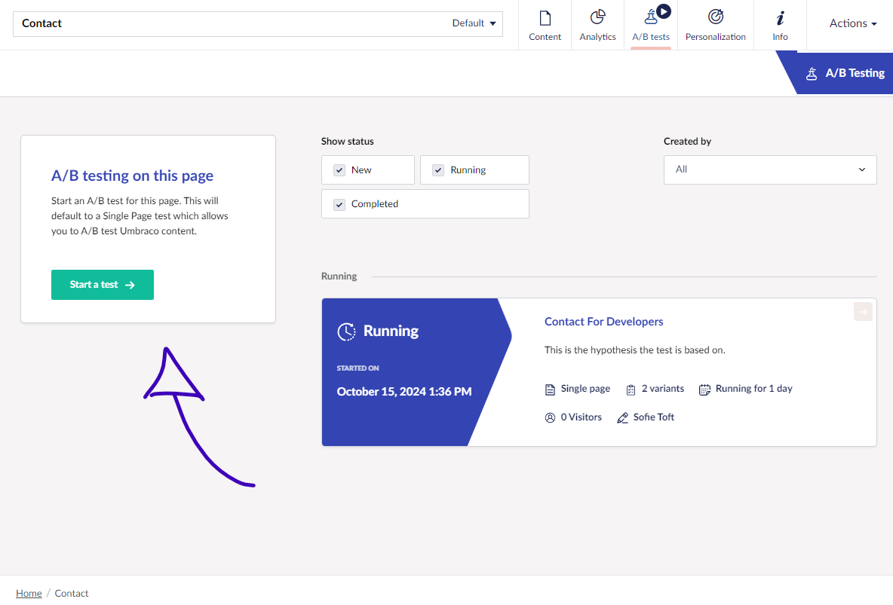
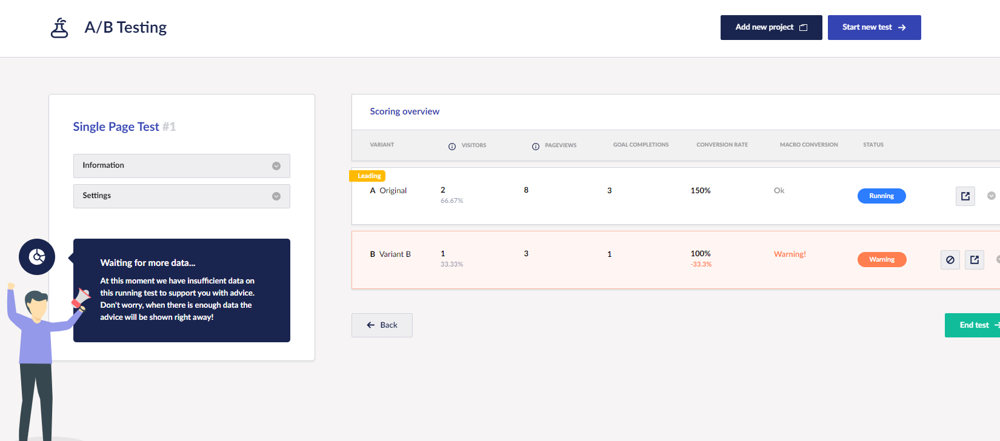

# Setting up the A/B Test

Setting up an A/B test in Umbraco Engage requires no code or need for any external tooling.

Starting A/B tests can be done in two ways:

* Initiate a Single Page, Multiple Page, or Document Type test via the Content App on the specific page,
* Initiate Multipage and Document Type tests via the Engage section.

## Set up the test

Open the Umbraco content tree and select the A/B tests Content App on the page.

Make sure that you have access to the Content App. [These permissions can be specified](../settings/permissions.md) per Document Types or User Groups.

When you open the Content App you will have an overview of all the A/B tests that are running or finished. You also have the option to start a new test.

## Configure the A/B test

When you start a new test you will have to specify the following:

* The name of the test.
* Which testing project it should be part of.
* Write a description/hypothesis.

After that, you have to specify the type of test and set up the specific test. It is also possible to preview your variant from here.

As a final step, you need to specify which goal you want to measure, as it is all about optimizing for this goal. Set the audience that you want to include in the test.

## Launching the A/B test

Once you have set everything up the test is ready to go. You can preview the final variants and check if everything set up correct.

If that is the case you can start the test immediately, or schedule it for later.

